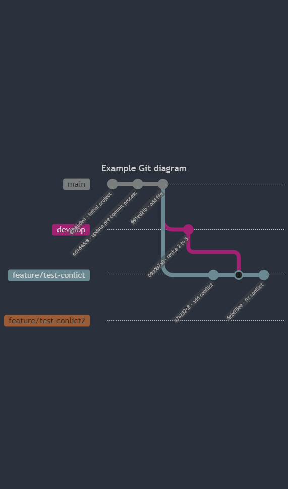
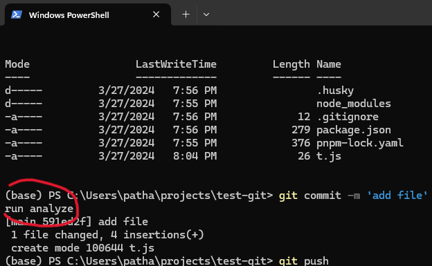
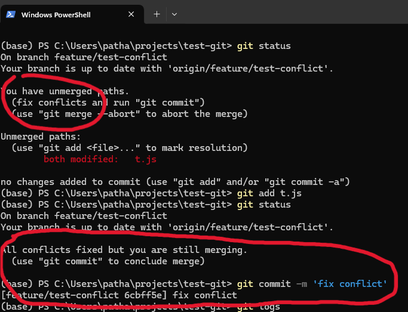
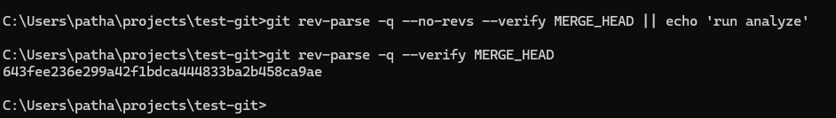

# Test git

## Husky bypass revise merge conflict



- `4738b0e4` - initial project
- `ed1d4dc8` - update pre-commit process

    ```sh
    # in .husky/pre-commit

    git rev-parse -q --no-revs --verify MERGE_HEAD || echo 'run analyze'
    ```

- `591ed2fb` - add file

    with content below:

    ```js
    11111
    22222
    33333
    44444
    ```

    > ---
    > You should **SEE** `run analyze`
    >
    > ---

    

- create branch `develop`
- create branch `feature/test-conlict`
- create branch `feature/test-conlict2`
- checkout `develop`
- `09d0b7a0` - revise 2 to 5

    with content below:

    ```js
    11111
    22522
    33333
    44444
    ```

- checkout `feature/test-conlict`
- `a7a282c8` - add conflict

    with content below:

    ```js
    11111
    22622
    33333
    44444
    ```

- merge `develop` into `feature/test-conlict`

    (now conflict)

- `6cbff5ee` - fix conflict

    then commit it.

    > ---
    > You should **NOT SEE** `run analyze`
    >
    > ---

    

## Example result from `rev-parse` with `MERGE_HEAD`


